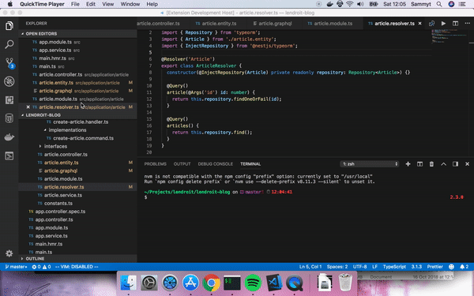

# tabagotchi README

This extension was inspired by this chrome extension [tabagoshi](http://tabagotcchi.com/). It prevents you from openning too many tabs (e.g. it helps you realise you are completely lost in your 15 tabs of Stack Overflow and you need to take a 5 min break)

## Features

This extensions warns you when you have too many files open in your workspace.

## Extension Settings

Soon you'll be able to configure the threshold of the warnings.

## Known Issues

At launch, the extensions tracks your open tabs by switching on each of them. I am waiting for [this VSCode issue](https://github.com/Microsoft/vscode/issues/15178) to be solved.

## Release Notes

### 0.0.1

Initial release:

- An error message and an info message are displayed when you open a file while more than 10 files where already open.

### 0.2.0

- Configuration setting to set the tab threshold before warnings appear (default value is 5).

## Coming soon

Implement an actual tabagoshi that will loose life if you have too many tabs, or will level up if you keep your workspace cleen.

This extension was developped at LEndroit.

